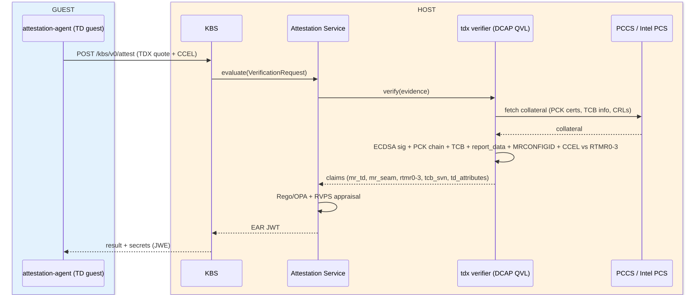

# Intel TDX Attestation — Step-by-Step Guide

Version 1.0.0

A guided walkthrough of how to set up and run Intel TDX attestation using
`tdx-attest.sh`. The installation layer
is distribution-pluggable (`lib/distros/`), but for now only SLES/openSUSE are
implemented.

Each step explains **what** happens, **why** it is needed, and **how to verify** it worked.

The whole process has two sides:

- **HOST** — the physical machine running the hypervisor. All commands in this
  guide run here (guest commands are executed remotely over SSH).
- **GUEST** — the virtual machine that becomes a *Trust Domain* (TD): its
  memory is encrypted and its state is measured by TDX hardware.

**Attestation flow (remote path, as driven by this guide):**

1. **Guest → Host (vsock:1041):** `/dev/tdx_guest` requests a TDX quote from QGS
2. **Guest → Host (HTTP:8080):** `kbs-client` submits the quote to KBS
3. **Host:** KBS delegates quote verification to CoCo-AS
4. **Host:** CoCo-AS fetches TCB collateral from Intel PCS (remote) — or from a local PCCS cache when run with `--collateral pccs`
5. **Host:** CoCo-AS evaluates the quote against reference values from RVPS and signs an EAR token
6. **Host:** KBS evaluates its resource policy (Rego) against the EAR token claims
7. **Host → Guest (HTTP:8080):** KBS releases the secret to `kbs-client`

> **Note:** the `tdx-attest.sh` script drives the guest over **ssh**
> (`setup-guest`, `attest`, `secret-get`), but the attestation data path
> itself is vsock (quote) + HTTP (KBS).
> Diagrams of the full process (guest vs host, local vs remote paths) are in
> the [Attestation Process — Visual Overview](#attestation-process--visual-overview) section near the end.

**The goal in one sentence:** prove to a remote verifier that the guest is a
genuine, untampered TDX Trust Domain, and only then hand it a secret.

## Source Code

The source code for these scripts is hosted on GitHub:

- **Repository:** [https://github.com/aginies/coco_tdx](https://github.com/aginies/coco_tdx)
- **Tarball:** [https://github.com/aginies/coco_tdx/releases](https://github.com/aginies/coco_tdx/releases) (when available)

### Getting the scripts

**Option 1 — Clone the repository (recommended for development or latest changes):**

```bash
git clone https://github.com/aginies/coco_tdx.git
cd coco_tdx
```

This gives you the full history, all branches, and the ability to update with
`git pull`.

**Option 2 — Download a specific release tarball:**

```bash
VERSION="1.0.0"
curl -LO "https://github.com/aginies/coco_tdx/releases/download/v${VERSION}/coco_tdx-${VERSION}.tar.gz"
tar xzf coco_tdx-${VERSION}.tar.gz
cd coco_tdx-${VERSION}
```

The tarball contains a versioned subdirectory with all scripts, the library,
and documentation — ready to use without Git.

**Option 3 — Download a single branch or tag:**

```bash
# Download a specific tag without cloning the full repo
curl -LO "https://github.com/aginies/coco_tdx/archive/refs/tags/v1.0.0.tar.gz"
tar xzf v1.0.0.tar.gz
cd coco_tdx-1.0.0
```

### Quick start

After obtaining the scripts, the recommended entry point is:

```bash
# Run the full capability check (no changes)
./tdx-attest.sh check

# One-shot setup of the entire stack
sudo ./tdx-attest.sh all --guest-iso /path/to/SLE-16.1.iso
```

## Contents

- [Source Code](#source-code)
- [Prerequisites](#prerequisites-before-any-script-command)
- [Platform Validation & Registration with pccs-check.sh](#platform-validation--registration-with-pccs-checksh)
- [One-shot setup: tdx-attest.sh all](#one-shot-setup-tdx-attestsh-all)
- [Step 1 — Check host capabilities](#step-1--check-host-capabilities)
- [Step 2 — Set up the host (DCAP stack)](#step-2--set-up-the-host-dcap-stack)
- [Step 3 — Set up QGS (quote signing)](#step-3--set-up-qgs-quote-signing)
- [Step 4 — Set up Trustee (attestation + secrets)](#step-4--set-up-trustee-attestation--secrets)
- [Step 5 — Create the Trust Domain (VM)](#step-5--create-the-trust-domain-vm)
- [Step 6 — Install the guest OS (manual)](#step-6--install-the-guest-os-manual)
- [Step 7 — Set up the guest (inside the TD)](#step-7--set-up-the-guest-inside-the-td)
- [Step 8 — Perform remote attestation](#step-8--perform-remote-attestation)
- [Step 9 — Secret delivery](#step-9--secret-delivery)
- [Step 10 — Verify everything is consistent (any time)](#step-10--verify-everything-is-consistent-any-time)
- [Step 11 — Cleanup (when done)](#step-11--cleanup-when-done)
- [Quick reference: the happy path](#quick-reference-the-happy-path)
- [Troubleshooting map](#troubleshooting-map)
- [Attestation Process — Visual Overview](#attestation-process--visual-overview)
- [Acronym Glossary](#acronym-glossary)
- [Appendix — JWT & EAR tokens](#appendix--jwt--ear-tokens)
- [License](#license)

---

## Prerequisites (before any script command)

| Requirement |
| --- |
| Intel CPU with TDX (Sapphire Rapids, Emerald Rapids, Xeon 6+) |
| TDX enabled in BIOS (SEAM loader present) |
| VT-x enabled in BIOS |
| Linux host (SLES 16.1 is the reference target) |
| Internet access to Intel PCS |
| `kvm_intel.tdx=1` (or `=Y`) in kernel command line (add in GRUB, then reboot) |

**What to prepare before you start:**

| Item | Where to get it | Needed for |
| --- | --- | --- |
| SLES 16.1 installer ISO | SUSE Customer Center (subscription) | `setup-vm` / `all` (`--guest-iso`) and the manual install in Step 6 |
| Intel Trusted Services subscription key | [Intel Trusted Services Portal](https://api.portal.trustedservices.intel.com/) | **Only** if your platform is unregistered (PCK cert 404) — for `register-platform --subscription <KEY>` |

If BIOS TDX is off, nothing later will work — the CPU will not report
`tdx_host_platform`.

---

## Platform Validation & Registration with pccs-check.sh

**Optional — you can skip this section.** You only need it if a later step
reports a PCK certificate `404` (platform not registered). It validates that
your platform's collateral is healthy: that Intel PCS serves a valid TCB
status for your processor, that no relevant keys are revoked, and that your
platform is properly registered for PCK certificate issuance.

### Automated Platform Validation

Both `pccs-check.sh` and `tdx-attest.sh` support **full auto-discovery** of your
platform parameters without having to manually locate or specify your FMSPC or PCK certs:

```bash
# Standalone diagnostic check (auto-detects FMSPC, PCK certs, and CPU model)
./pccs-check.sh check --auto --tdx

# Or integrated through tdx-attest.sh:
sudo ./tdx-attest.sh check-platform

# Or alongside the host capability check:
sudo ./tdx-attest.sh check --check-platform
```

The script automatically searches for:

1. Cached PCK certificates in `/var/lib/sgx/`, `/var/cache/pccs/`, or `/run/dcap/`.
2. Existing CSV outputs from `PCKIDRetrievalTool` (`/tmp/pckid_retrieval.csv`).
3. Hardware extraction via `PCKIDRetrievalTool`.
4. Host CPU model and family/model/stepping mapping from `/proc/cpuinfo` (e.g. Intel Xeon 6 / Emerald Rapids / Sapphire Rapids).

---

### Platform Registration with Intel SGX/TDX Registration Service

#### When is Platform Registration Required?

On modern multi-package and scalable Intel server processors (including **Xeon 6 / Granite Rapids**, Emerald Rapids, and Sapphire Rapids), Intel does **not** publish PCK certificates by default until the platform's hardware manifest is registered.

If your host has not been registered with Intel, you will observe the following symptoms:

- Running `check-platform` reports `404 Not Found` when requesting PCK certificates.
- QGS logs show:

  ```text
  qgs[3874]: [QCNL] HTTP status code: 404
  qgs[3874]: [QPL] No certificate data for this platform.
  qgs[3874]: [get_platform_quote_cert_data td_ql_logic.cpp:270] Error returned from the p_sgx_get_quote_config API. 0xe011
  ```

- Guest quote generation fails with error `0xe011` or `0xe01b`.

#### Fully Automated Registration

You can register your platform with a single command using your Intel Trusted Services subscription key (from the [Intel Trusted Services Portal](https://api.portal.trustedservices.intel.com/) for the *Intel® Software Guard Extensions Registration Service*):

```bash
# Using pccs-check.sh:
sudo ./pccs-check.sh register --subscription "YOUR_PRIMARY_KEY"

# Or using tdx-attest.sh:
sudo ./tdx-attest.sh register-platform --subscription "YOUR_PRIMARY_KEY"
```

#### What the command automates

1. **Extracts the Platform Manifest**:
   - Reuses existing retrieval outputs (`/tmp/pckid_retrieval.csv`) if already generated.
   - If missing or if the CSV was generated in enclave mode, it queries UEFI non-enclave hardware identifiers via `PCKIDRetrievalTool -platform_id <HOSTNAME> -f /tmp/pckid_manifest.csv`.
2. **Converts Manifest to Binary**:
   - Automatically converts the raw hexadecimal platform manifest into binary format portably using `xxd`, `python3`, `perl`, or shell builtins (no manual hex formatting or conversion needed).
3. **Submits to Intel Registration Service**:
   - Performs a binary HTTP POST (`application/octet-stream`) to:
     `POST https://api.trustedservices.intel.com/sgx/registration/v1/platform`
4. **Verifies Registration**:
   - On `HTTP 201 Created`, extracts the registered PPID and immediately triggers a live reachability check against Intel PCS to verify that PCK collateral is active.

---

### Manual / Advanced Platform Queries

You can also run granular checks using `pccs-check.sh`:

#### 1. Inspect Detailed TCB Levels & Advisories

To see all valid TCB levels, microcode requirements, and CVE advisories for your processor:

```bash
./pccs-check.sh tcb --tdx
# Or with explicit FMSPC:
./pccs-check.sh tcb --fmspc <YOUR_FMSPC> --tdx
```

Example output:

```text
=== TCB Status Check for FMSPC: 00A06D080000 ===

[OK] PCS endpoint: https://api.trustedservices.intel.com/tdx/certification/v4/tcb
[OK] TCB info retrieved (HTTP 200)

TCB Levels:
-----------
PCESVN STATUS         DATE         WARNING
------ ------         ----         -------
13     UpToDate       2025-08-13
13     OutOfDate      2025-05-14
5      OutOfDate      2018-01-04
```

Interpreting the TCB Status:

- **UpToDate:** The platform has the latest microcode and BIOS patches.
- **OutOfDate:** Platform needs a CPU microcode or BIOS update from your OEM.
- **ConfigurationNeeded / SWHardeningNeeded:** BIOS configuration or kernel mitigation parameters are missing.
- **Revoked:** Keys or platform revoked by Intel.

#### 2. Test TDX Quoting Enclave Identity

To confirm that Intel PCS serves the TDX QE identity matching your environment:

```bash
./pccs-check.sh qe-identity --tdx
```

Should return HTTP 200 and show enclave identity `TD_QE` with `isvprodid: 2`.

#### 3. Test PCK Certificate Issuance Directly

```bash
./pccs-check.sh pckcert \
  --ppid <768-hex-chars> \
  --cpusvn <32-hex-chars> \
  --pcesvn <4-hex-chars> \
  --pceid <4-hex-chars> \
  --subscription <YOUR_KEY>
```

---

## One-shot setup: tdx-attest.sh all

Instead of running Steps 1–5 one by one, a single command chains them:

```bash
sudo ./tdx-attest.sh all --guest-iso /path/to/SLE-16.1.x86_64.iso
```

It runs `check` → `setup-host` → `setup-qgs` → `setup-trustee` → `setup-vm`
in order, **stops on the first hard failure** (the capability check aborts
before anything is installed), and finishes with a `verify` audit of the
host-side configuration.

- *When to use it:* a fresh host where you want the complete stack up in one
  go.
- *When to use the individual steps instead:* debugging a specific layer, or
  re-running after a partial failure — every step is idempotent, so re-running
  just the failed one is safe.

`all` stops at VM start: the manual guest OS install (Step 6) and everything
after it (Steps 7–9) still has to be done by hand. **If you used `all`, skip
straight to Step 6** — Steps 1–5 above are only for running things
individually.

---

## Step 1 — Check host capabilities

**Command:**

```bash
sudo ./tdx-attest.sh check
```

**What it does:** runs 12 read-only probes (or 13 with `--check-platform`). No changes, no root strictly
required.

**Why each probe exists:**

| Probe | Tool | Why we check it |
| --- | --- | --- |
| CPU TDX flag | `grep /proc/cpuinfo` | Hardware must advertise `tdx_host_platform`. Fallback: `kvm_intel.tdx=Y` in sysfs. |
| KVM | `stat /dev/kvm` | No `/dev/kvm` → no VMs at all. |
| libvirt | `virsh -c qemu:///system version` | A successful connection proves libvirt works. Works for both the modular layout (SLES 16: `virtqemud` socket-activated) and the old monolithic one. |
| QEMU version | `qemu-system-x86_64 --version` | TDX support requires QEMU ≥ 8.0. |
| QEMU TDX object | `qemu-system-x86_64 -object help` | TDX is a QEMU *object* (`tdx-guest`), not a machine type — so we probe the object list, not `-machine help`. |
| TDX OVMF firmware | scan `/usr/share/qemu/firmware/*.json` | A TDX-specific UEFI firmware must exist to boot the TD. |
| TDX module | `dmesg \| grep 'TDX-Module initialized'` | Real proof the TDX module is up and KVM TDX is enabled. Requires `kvm_intel.tdx=1` in the kernel command line (see Prerequisites). |
| DCAP packages | `rpm -qa` | Quote-verification libraries. |
| QGS service | `systemctl`, socket checks | Quote signing service (Step 3). |
| Trustee services | `systemctl` ×3 | Attestation stack (grpc-as, kbs, rvps; Step 4). |
| Ports 3000/8080 | `ss -tln` | CoCo-AS and KBS must listen. |
| PCS reachability | `curl -sI` | Intel PCS (remote) — or a local PCCS cache — is where PCK/quote certificates come from. |
| Platform collateral | `pccs-check.sh` | Deep TCB status and PCK validity check (included when run with `--check-platform`). |

**Expected result:** all rows PASS (WARN is non-fatal).

**If FAIL:** read the HINT column — it tells you the exact fix (BIOS setting,
package to install, service to start).

> **Tip:** run `sudo ./tdx-attest.sh check --check-platform` to include the in-depth Intel PCS/PCCS collateral validation probe.

---

## Step 2 — Set up the host (DCAP stack)

**Command:**

```bash
sudo ./tdx-attest.sh setup-host
```

**What it does, in order:**

1. **Installs the DCAP attestation libraries** (`suse-libsgx-dcap-default-qpl`,
   `libdcap_quoteprov1`, `libsgx_dcap_quoteverify1`) via `zypper`.
   - *Why:* DCAP (Data Center Attestation Primitives) is Intel's standard
     attestation stack. The Quote Provider Library (QPL) fetches PCK
     certificates from Intel PCS (or a local PCCS cache); the quoteverify library is what CoCo-AS links
     against to check signatures.
   - The script only installs what's missing (`rpm -q` first), so re-runs are
     quiet.

2. **Confirms the TDX module is initialized** (dmesg / sysfs).
   - *Why:* sanity gate before going further.
   - Note it deliberately does **not** `modprobe tdx_guest` — that module only
     exists *inside* a Trust Domain, never on the host.

3. **Writes the QCNL config** (`/run/dcap/qcnl.conf`).
   - *Why:* QCNL tells DCAP components where the PCCS is and how to cache.
     Without it, collateral fetching uses wrong defaults and verification
     fails. The script prefers the packaged default config if present.

4. **Ensures libvirt is running** (enables `virtqemud.socket` etc. if needed).
   - *Why:* Step 5 needs it to create the VM.

5. **Ensures `grpcurl` is available** (installs distro package or official prebuilt binary).
   - *Why:* Step 8 uses `grpcurl` to communicate directly with the CoCo-AS gRPC service for quote appraisal.

> **Tip — local PCCS / air-gapped environments:**
> When using a local caching PCCS instead of Intel PCS:
>
> ```bash
> sudo ./tdx-attest.sh setup-host --collateral pccs --pccs-url http://<PCCS_HOST>:8081
> ```
>
> For custom or self-signed HTTPS PCCS deployments, pass `--pccs-ca /path/to/pccs-root-ca.pem` (or `--insecure` to bypass TLS verification).

**Verify:**

```bash
rpm -qa | grep -Ei 'dcap|sgx|qpl'        # packages present
cat /run/dcap/qcnl.conf                   # pccs_url set
virsh -c qemu:///system version           # libvirt answers
```

---

## Step 3 — Set up QGS (quote signing)

**Command:**

```bash
sudo ./tdx-attest.sh setup-qgs
```

**Background — why QGS exists at all:**
A Trust Domain cannot sign its own attestation quote — it has no keys inside.
Instead it produces a *TD Report* and asks a host-side service, **QGS**
(Quote Generation Service), to sign it. QGS holds the quoting key and
talks to the TD over **vsock** (a VM-to-host channel that bypasses the
network).

**What it does, in order:**

1. **Installs `suse-tdx-qgs`** → provides `/usr/libexec/qgs` + `qgsd.service`.

2. **Forces QGS into unix-socket mode** via a systemd drop-in:

   ```
   Environment=QGSD_ARGS="--no-daemon -n=4"
   ```

   - *Why (critical):* the default SUSE unit runs QGS in **TCP mode**
     (`-p=4050`), but QEMU's `tdx-guest` object only connects via the **unix
     socket** `/run/tdx-qgs/qgs.socket`. This mismatch is the #1 TDX setup
     bug — quotes silently fail at VM runtime. Dropping `-p=` fixes it.
   - *Why a drop-in, not editing the unit:* drop-ins survive package upgrades.

3. **Removes a stale `qgs.socket` symlink** if present.
   - *Why:* old QGS versions left a symlink to a nonexistent file; it blocks
     creation of the real socket.

4. **Adds the `qemu` user to the `qgsd` group.**
   - *Why:* QEMU mediates the vsock→QGS connection and runs as user `qemu`;
     the socket is owned `qgsd:qgsd` mode 640, so `qemu` needs group access.

5. **Writes QCNL config to all three locations**
   (`/etc/sgx_default_qcnl.conf`, `/run/dcap/qcnl.conf`, `/etc/dcap/qcnl.conf`)
   with `qgsd:sgx_prv` ownership.
   - *Why three paths:* different DCAP components read different files. QGS
     reads `/etc/sgx_default_qcnl.conf`; others read the `/run` and `/etc/dcap`
     copies.

6. **Creates `qgsd-setup.service`** (a oneshot that restores the QCNL config
   at every boot) + a tmpfiles rule for `/run/dcap`.
   - *Why:* `/run` is tmpfs — it's wiped on reboot. Without this, QGS loses
     its PCCS config after every restart and quote generation breaks.

7. **Enables and starts `qgsd.service`.**

**Verify:**

```bash
systemctl is-active qgsd.service          # active
ls -la /run/tdx-qgs/qgs.socket            # real socket, not symlink
id qemu | grep qgsd                       # qemu in qgsd group
```

---

## Step 4 — Set up Trustee (attestation + secrets)

**Command:**

```bash
sudo ./tdx-attest.sh setup-trustee
```

**Background — the attestation stack's three roles:**

| Service | Role in one line |
| --- | --- |
| **CoCo-AS** (`grpc-as`) | The verifier: checks a quote's signature and measurements, returns an **EAR token** (a JWT containing the measured claims + an `allow` decision). |
| **KBS** | The vault: stores secrets; releases one only to a client presenting a valid EAR token that passes the resource policy. |
| **RVPS** | The reference list: holds the expected measurements (e.g. MRTD) CoCo-AS compares against. |

**What it does, in order:**

1. **Installs `trustee` + DCAP verify libraries.**
   - *Why:* provides the three services; the extra libs are what grpc-as links
     against for signature verification.

2. **Checks `ldd` on grpc-as.**
   - *Why:* fail now on missing shared libraries instead of a service that
     crashes at runtime with an obscure log.

3. **Generates the CoCo-AS signer keypair (EC P-256), the JWKS file, and a
   self-signed X.509 certificate for the token's `x5c` chain.**
   - *Why:* CoCo-AS signs EAR tokens with this key. If no persistent signer is
     configured, grpc-as uses an *ephemeral* key — tokens become unverifiable
     and KBS rejects everything. This SLE build of grpc-as doesn't serve a
     `/.well-known/jwks.json` endpoint, so the script derives the JWKS
     manually from the public key (openssl → x/y coordinates → JSON). KBS is
     pointed at it via `file://` (it rejects plain `http://`).
   - *Why also a certificate:* the token header embeds the signing key as a
     `jwk`, and when it does, KBS **requires** a non-empty `x5c` chain that
     chains to `attestation_token.trusted_certs_paths` — otherwise it rejects
     the token ("neither trusted jwk set nor trusted pem public key works").
     A bare public key as the AS `cert_path` yields an empty `x5c`, so the
     script derives a self-signed cert from the signer key
     (`/etc/trustee/as-signer.crt`), points `grpc-as.json` `cert_path` at it,
     and lists it in `kbs.json` `trusted_certs_paths`.

4. **Generates the KBS admin keypair (ed25519).**
   - *Why:* admin-mode operations (storing secrets, setting policy) authenticate
     with this key. Private key stays root-only; KBS only needs the public
     half.

5. **Writes the resource policy (Rego).**
   - *Why:* this policy decides *which* attested clients may fetch *which*
     secrets. **Warning:** the script writes an **allow-all** policy — a lab default.
     For production, gate it on real claims (e.g. `tdx.report.mrtd`).

6. **Writes the three config files:**
   - `/etc/grpc-as.json` → CoCo-AS: storage dir, signer key, PCCS URL for
     collateral.
   - `/etc/kbs.json` → KBS: listen address, CoCo-AS address, JWKS file,
     policy path. (Lab settings: `insecure_http`, `InsecureAllowAll`.)
   - `/etc/rvps.json` → RVPS: storage dir.
   - *Why explicit configs:* every component must point at the same endpoints;
     inconsistent addresses are a classic silent failure.

7. **Overrides `kbs.service` and `grpc-as.service` ExecStart** via drop-ins.
   - *Why:* the packaged units don't pass the config file correctly (KBS omits
     `--config-file`; grpc-as's env var isn't expanded and uses a wrong flag
     name). Without the override, both run with built-in defaults → broken
     attestation.

8. **Starts services in dependency order:**
   `rvps` → `grpc-as` → *wait for port 3000* → `kbs`.
   - *Why this order:* KBS loads the JWKS file at startup, so CoCo-AS must be
     up first; the policy upload needs KBS up.
   - *Note on `trustee.service`:* the monolithic `trustee.service` package unit is intentionally disabled. It is redundant with the dedicated `grpc-as`, `kbs`, and `rvps` services, and its unit requires `/etc/trustee.json` which is not used in this architecture.

9. **Uploads the resource policy to KBS** with `kbs-client
    config set-resource-policy`.
    - *Why:* KBS only enforces a policy that has been pushed into it.

**Verify:**

```bash
systemctl is-active grpc-as kbs rvps           # all active
ss -tln | grep -E '3000|8080'                  # ports listening
```

> **Note — lab vs production:** this setup is deliberately a **lab
> configuration**. Three things are permissive and must be changed for real
> use: (1) the resource policy is **allow-all** — any attested client can
> fetch any secret; in production, gate it on real claims (e.g.
> `tdx.report.mrtd`). (2) KBS runs with `insecure_http` +
> `InsecureAllowAll` — no TLS, no tenant isolation. (3) Step 9 Method B leaves
> the EAR token on the host, so anyone holding it can fetch the secret — use
> the in-guest `kbs-client` (Method A) for real secret gating.

---

## Step 5 — Create the Trust Domain (VM)

**Command:**

```bash
sudo ./tdx-attest.sh setup-vm --guest-iso /path/to/SLE-16.1.iso
```

**Options (with defaults):**

| Option | Default | Description |
| --- | --- | --- |
| `--guest-iso PATH` | *(mandatory)* | Path to installer ISO |
| `--vm-name NAME` | `tdx-guest` | Libvirt domain name |
| `--vm-mem MB` | `16384` | RAM in megabytes (16 GB) |
| `--vm-cpu N` | `4` | Number of vCPUs |
| `--vm-disk SIZE` | `32G` | Qcow2 disk size |
| `--ssh-key PATH` | `~/.ssh/id_ed25519` | SSH keypair to generate/inject |
| `--virt-install` / `--no-virt-install` | `auto` | VM creation engine: `virt-install` if available, else generated XML |
| `--vnc-listen ADDR` | `0.0.0.0` | VNC listen address (use `127.0.0.1` for host-local only) |
| `--dry-run` | *(off)* | Print the `virt-install` command without executing (no root needed) |
| `--no-tdx` | *(off)* | Create regular non-TDX VM (for later `convert-tdx`) |

**What it does, in order:**

1. **Locates the TDX OVMF** via QEMU firmware descriptors and **confirms QEMU
   has the `tdx-guest` object.**
   - *Why:* fail fast — creating a VM that can't be a TD wastes the whole
     install cycle.

2. **Creates the qcow2 disk** (32G default) — by `virt-install` itself when
   the virt-install engine is used, otherwise `qemu-img create`.
   - *Why:* guest storage. If the disk already exists it's reused — but only
     counted as "has an OS" when it actually contains a filesystem
     (`virt-filesystems`); a leftover empty qcow2 from an aborted install is
     treated as fresh.

3. **Creates the domain definition.** Two engines, same result:

   - **virt-install engine (default when `virt-install` is installed):**
     the script extracts the installer kernel/initrd from the ISO
     (`/boot/x86_64/loader/{linux,initrd}`) into
     `/var/lib/libvirt/boot/<vm>-installer-{kernel,initrd}`, then runs
     `virt-install --name … --memory … --vcpus … --disk … --cpu
     host-passthrough --network network=default,model=virtio --graphics
     vnc,listen=… --video virtio --boot cdrom,hd <firmware> --qemu-commandline="-object
     tdx-guest,id=tdx -machine confidential-guest-support=tdx" --location <ISO>
     --extra-args console=ttyS0,115200 --print-xml` — i.e. **XML generation
     only, nothing is started**. (On virt-install 5.x the firmware is
     injected with `--xml` XPath as a stateless ROM loader and the machine
     pinned to `q35`; older versions auto-detect `--bios`/`-bios`/
     `--firmware` from `virt-install --help`.) The XML's one-shot
     `<kernel>`/`<initrd>` boot is repointed at the persistent extracted
     files (virt-install deletes its own `--location` extraction on exit),
     then the domain is defined and started **once** — so the TDX patch is
     in place *before* the first boot.
     - *Why patch before first boot (not define→destroy→patch→start):*
       libvirt drops the one-shot `<kernel>` installer boot from the
       persistent config at first start, so a restart after the patch would
       fall through to firmware boot — and a stateless TDX OVMF inside a TD
       does **not** auto-boot the IDE cdrom (it sits at the OVMF setup
       screen; the identical XML boots the CD fine in a non-TDX VM). The
       installer would be cut off.
     - *Why `--location` direct kernel boot:* bypasses firmware boot-device
       selection entirely; the ISO stays attached as a cdrom for the
       installer to use as its source; `console=ttyS0` puts the installer on
       the serial console. After the install, the guest reboots, libvirt has
       already dropped the one-shot kernel, and the firmware boots the
       installed OS from disk (the same shape as a working installed TD).
   - **Generated XML engine** (`--no-virt-install`, or automatic fallback):
     the script writes the full domain XML itself.

   The TDX-critical elements and *why* each (both engines produce these):

   | XML element | Why it's required |
   | --- | --- |
   | `<launchSecurity type='tdx'>` + `<quoteGenerationService path=...>` | Tells libvirt/QEMU to launch this VM as a TD and where QGS lives. |
   | `<loader type='rom' format='raw' stateless='yes'>` | TDX OVMF is memory-mapped via `-bios` (ROM loader). **Must NOT be pflash** — pflash needs a readonly memslot which TDX private memory doesn't support. With pflash, libvirt silently falls back to normal firmware and the guest is *not* a TD. |
   | `<vsock model='virtio'>` | The only channel for the TD to reach QGS for quote signing. |
   | `<pm><suspend-to-mem/disk enabled='no'>` | TDX TDs cannot suspend/hibernate — the saved image would be unmeasured/unencrypted. |
   | (no `<memoryBacking>`, no `<ioapic>`) | libvirt auto-adds memfd backing + split irqchip for TDX; setting them explicitly breaks launch. |
   | virtio video + serial console | The display path that works for the ISO installer on a TDX TD. |

4. **Generates an SSH key** (`ssh-keygen -t ed25519`) if absent.
   - *Why:* all later steps drive the guest passwordlessly over SSH.

5. **If the disk already has an OS:** injects the SSH key and disables
   suspend via `virt-customize` (libguestfs offline disk editing).
   - *Why virt-customize:* it mounts the disk image without booting the VM —
     faster and more reliable than console editing.
   - On a **fresh empty disk** this is skipped (nothing to mount); you inject
     the key after the OS install instead.

6. **Defines and starts the VM** with `virsh` (generated-XML engine also
   attaches the ISO with `attach-disk --config` first; the virt-install
   engine attaches it via `--location`/cdrom at XML-generation time).
   - *Why `--config` on attach-disk:* persists the ISO into the domain
     definition; a live attach would fail before the domain exists at runtime.

**Alternative path — converting an existing VM:**
If you already have a VM (disk, network, OS) you'd rather not reinstall:

```bash
sudo ./tdx-attest.sh setup-vm --no-tdx --guest-iso /path/to/iso   # or use any existing VM
virsh shutdown <vm>
sudo ./tdx-attest.sh convert-tdx --convert-vm <vm>
```

> **Tip:** If `--convert-vm` is omitted, `convert-tdx` automatically detects running/available VMs and prompts interactively.

`convert-tdx` edits the domain XML in place (pflash→ROM loader, adds
`launchSecurity` + `vsock`, disables suspend) using a small Python XML
transformer, with automatic backup and rollback. *Why Python:* bash text
munging of XML is fragile; ElementTree parses it properly.

**Verify:**

```bash
virsh list                                # VM running
virsh dumpxml tdx-guest | grep -E 'launchSecurity|vsock|loader'
```

---

## Step 6 — Install the guest OS (manual)

The installer **boots automatically** on the first start (one-shot direct
kernel boot from the ISO — see Step 5); you only drive the installer itself
through the console.

1. **Open the console:**

   ```bash
   virsh console tdx-guest
   ```

   - *Why console:* the installer is wired to `console=ttyS0` (serial) — the
     reliable channel for a TD. The VNC display works too (TDX screen
     sharing), but the serial console never depends on the guest's display
     stack.

2. **Install SLES 16.1** from the ISO. Use the default kernel (6.1+ is
   required for TDX guest support).

3. **After install + reboot, get the guest IP:**

   - *Why this just works:* the one-shot installer `<kernel>` is dropped from
     the domain config after the first boot, so the post-install reboot boots
     the installed OS from disk via the (stateless) TDX OVMF — no manual XML
     editing needed. The extracted installer kernel/initrd in
     `/var/lib/libvirt/boot/` are now unused and can be removed.

   ```bash
   virsh net-dhcp-leases default
   # or inspect all VMs:
   sudo ./tdx-attest.sh show-vm-info
   ```

   - *Why:* the guest got DHCP on libvirt's default network; the script needs
     this IP for SSH.

> **Tip — Guest IP auto-detection:**
> When only one VM is running, subsequent commands (`setup-guest`, `attest`, `register-rv`, `secret-get`) will auto-detect the guest IP if `--guest-ip` is omitted.

1. **If you skipped key injection (fresh disk), inject it now:**

   ```bash
   sudo virt-customize -a /var/lib/libvirt/images/tdx-guest.qcow2 \
       --ssh-inject root:file:$HOME/.ssh/id_ed25519.pub
   ```

   (VM must be stopped for this; or paste the key via console.)

**Verify:**

```bash
ssh -i ~/.ssh/id_ed25519 root@<GUEST_IP> echo ok
```

---

## Step 7 — Set up the guest (inside the TD)

**Command (run on the HOST, acts inside the guest via SSH):**

```bash
sudo ./tdx-attest.sh setup-guest --guest-ip <GUEST_IP>
```

**What it does, in order — with the guest/host distinction explicit:**

1. **Tests SSH connectivity** to the guest.
   - *Why:* fail early with a troubleshooting checklist (sshd running? key
     present? right IP? firewall?) instead of dying mid-setup.

2. **Refuses to run if the target is the host.**
   - *How:* checks `kvm_intel.tdx=Y` — that parameter only exists on a TDX
     host, never inside a TD.
   - *Why:* pointing this at the host would fail later with a misleading
     "Failed to get the report" error.

3. **Confirms the TDX guest device exists** (`/dev/tdx_guest`, trying three
   name variants).
   - *Why:* this character device is **the proof you're inside a real Trust
     Domain**. It's created by the kernel's TDX guest driver only when the
     VM was launched as a TD. (Name varies by kernel/driver version, hence
     three tries.)

4. **Disables suspend/hibernate in the guest** (masks sleep targets, ignores
   hardware keys).
   - *Why:* TDX cannot hibernate — the disk image would be unmeasured and
     unencrypted, breaking the attestation guarantee.

5. **Installs attestation libraries in the guest** (`libtdx_attest1`,
   `libdcap_quoteprov1`, QPL, `trustee` package).
   - *Why:* `test_tdx_attest` and `kbs-client` link against these to talk to
     `/dev/tdx_guest` and QGS.

6. **Verifies the packaged `kbs-client` has the TDX attester** (and removes
   any stale source-built `/usr/local/bin/kbs-client-tdx`).
   - *Why:* the SLE `trustee` package (≥ 0.21) ships a TDX-attester-capable
     kbs-client at `/usr/libexec/trustee/kbs-client`, version-aligned with the
     host verifier stack. Older builds lacked the TDX attester (fake "Sample
     Attester"), and source builds from upstream master can drift ahead of the
     packaged verifier — e.g. a newer attestation-agent whose CC event log the
     host tdx-verifier cannot replay (RTMR[3] mismatch). If the package client
     lacks the attester, the script dies with an upgrade hint instead of
     falling back to a source build.

7. **Builds `tdx-quote-gen` in the guest** (from `tools/tdx-quote-gen.c`,
   installing `gcc` if needed).
   - *Why:* the distro's `test_tdx_attest` always mints quotes with *random*
     report data (it never reads argv). Host-mode `secret-get` needs a quote
     whose `report_data` is bound to a TEE public key, so the script builds a
     minimal `tdx_att_get_quote` wrapper that takes the report data as an
     argument. Installed at `/usr/local/bin/tdx-quote-gen`.

8. **Writes the QCNL config inside the guest.**
   - *Why:* guest-side DCAP components also need to know the PCCS URL.

9. **Runs 6 QGS pre-flight checks (on the host).**
   - *Why:* `test_tdx_attest` fails *opaquely* if host-side QGS is
     misconfigured. Checking up front — QGS socket mode, socket file, qemu
     group, QCNL, PCCS reachability, VM vsock — pinpoints the exact red item
     instead of guessing.

10. **Generates the first quote:**

   ```
   test_tdx_attest   (in guest workdir /root/tdx-attest)
   ```

   - *Why:* this is the DCAP test program. It requests a TD Report from
     `/dev/tdx_guest`, sends it to QGS over vsock, and writes the signed
     `quote.dat`. Success here proves the entire quote path works:
     TD → vsock → QGS → signing.
   - On failure, the script re-runs the pre-flight checks and shows you which
     one(s) are red.

**Verify (inside guest):**

```bash
ls -la /root/tdx-attest/quote.dat /root/tdx-attest/report.dat
```

---

## Step 8 — Perform remote attestation

This is the end-to-end live attestation: once your TD guest is running with
QGS, `attest` generates a TD quote (via QGS and the host's PCK certificate),
submits it to CoCo-AS, which fetches official collateral from Intel PCS and
verifies the signature, TCB status, and quote freshness, then returns an EAR
token — `affirming` when the platform is valid and reference values are
enrolled.

**Command (on the host):**

```bash
sudo ./tdx-attest.sh attest --guest-ip <GUEST_IP>
```

**What it does, in order:**

1. **Generates a fresh quote** in the guest (`test_tdx_attest` via SSH).
   - *Why fresh:* quotes are one-time — bound to a nonce; a reused quote is
     rejected.

2. **Fetches the quote** (base64-encoded over SSH).
   - *Why base64:* it's binary data that must travel inside a JSON request.

3. **Submits it to CoCo-AS** with:

   ```bash
   grpcurl -plaintext -import-path protos -proto attestation.proto -d @ 127.0.0.1:3000 \
       attestation.AttestationService/AttestationEvaluate < req.json
   ```

   - *Why grpcurl:* CoCo-AS speaks gRPC; grpcurl is the standard CLI for
     calling gRPC services without writing code. `tdx-attest.sh` automatically installs
     prebuilt `grpcurl` into `/usr/local/bin` (or `~/.local/bin`) if missing.
   - *What CoCo-AS does with it:* verifies the QGS signature, fetches PCK
     collateral from Intel PCS (or a local PCCS cache), checks the TCB status, compares measurements
     (MRTD etc.) against RVPS reference values, then returns an **EAR token**
     — a JWT containing all measured claims plus an `allow: true/false`
     decision.

4. **Decodes the EAR JWT and checks `allow: true`.**
   - *Why look in the JWT:* the policy decision lives *inside the token*, not
     in the gRPC response body. `allow: true` = attestation succeeded.

**The EAR token in one sentence:** CoCo-AS wraps the verified quote in an
**EAR token** — a JWT (built on EAT, RFC 9711) carrying the measured claims
plus the `allow` decision; KBS verifies its signature and reads `allow`
without re-doing the attestation. *(Full background: “Appendix — JWT & EAR
tokens” at the end of this guide.)*

The `attest` command decodes the EAR token (a JWT built on EAT, RFC 9711): extracts payload, formats claims, displays a structured verification report, and checks `ear.status` as well as the Intel PCS `tcb_status`.

**Expected output (Hardware quote verified, awaiting RVPS enrollment):**

```
=============================================================================
                       TDX REMOTE ATTESTATION REPORT
=============================================================================
  Hardware Verification (Intel DCAP / PCS v4):
    TCB Status:             UpToDate
    TEE Type:               81000000 (0x81000000 = Intel TDX)
    TDX Module (MRSEAM):    2d2d09cffbb74f850e04fcf1f40d6c41...
  Guest Launch Measurements:
    MRTD (TD Build):        52ffcc966ddecef5badce4f6715b0cb8...
    RTMR 0 (SEAM):              db6fb215385b6f0f5124eaf26dd9440a...
    RTMR 1 (TDVF):              ef68a00f527204a599082ae0510e991b...
    RTMR 2 (Bootloader/Kernel): 14e943761f4c826c1ea2ebb27f1af4cd...
    RTMR 3 (Guest OS):          ad0355928a1ff9772f0912d168a085b7...
    XFAM (Features):        e71a060000000000
  Trustee Appraisal Result (RVPS):
    EAR Status:             contraindicated
=============================================================================
[INFO] === HARDWARE ATTESTATION SUCCESS: Quote verified by Intel PCS (TCB: UpToDate) ===
[WARN] Appraisal status is 'contraindicated' because reference values are not enrolled in RVPS.
[WARN] To register current guest measurements in RVPS and achieve 'affirming' status, run:
  ./tdx-attest.sh attest --guest-ip <GUEST_IP> --register-rv
  or: ./tdx-attest.sh register-rv --guest-ip <GUEST_IP>
```

**Expected output (Fully appraised with RVPS reference values):**

```
=== ATTESTATION SUCCESS: ear.status = affirming ===
Intel DCAP hardware verification AND Trustee appraisal passed!
```

**Enrolling Reference Values into RVPS:**

Trustee 0.20's default appraisal policy requires `mr_td`, `rtmr_1`, `rtmr_2`, and `xfam` to match approved reference values stored in the Reference Value Provider Service (RVPS). You can enroll the guest's measurements directly:

```bash
# Enroll reference values and attest in one step:
sudo ./tdx-attest.sh attest --guest-ip <GUEST_IP> --register-rv

# Or enroll separately:
sudo ./tdx-attest.sh register-rv --guest-ip <GUEST_IP>
sudo ./tdx-attest.sh query-rv --id mr_td
```

### The four RTMRs (Runtime Measurement Registers)

A TDX Trust Domain has four 48-byte, extend-only measurement registers
(SHA-384), analogous to TPM PCRs. Each boot stage *extends* the next:
`RTMR = SHA384(RTMR ‖ data)`. Standard TDX register assignments:

| Register | Measures | Extended by | Stability |
| --- | --- | --- | --- |
| **RTMR 0** | SEAM module (TDX firmware) | TDX module at boot | Static per SEAM version |
| **RTMR 1** | TDVF (virtual firmware / OVMF) | Virtual firmware at boot | Static per image |
| **RTMR 2** | Guest bootloader + kernel + cmdline | Bootloader (grub/td-shim), then runtime extends (below) | **Dynamic** |
| **RTMR 3** | Guest OS | OS runtime extends | Dynamic |

`MRTD` is the separate *build-time* measurement of the initial TD memory
(static, set at launch). RTMR 0/1 are stable for a given SEAM module + TDVF
image; RTMR 2/3 are where boot and runtime activity shows up.

### Understanding `ear.status: warning` & the RTMR 2 mismatch

You may see `ear.status: warning` instead of `affirming`. The cause chain:

1. **EAR status = the worst of its component claims.** The AR4SI trust vector
   reports `hardware`, `configuration`, and `executables` separately, and the
   overall status is the worst of them. Here `hardware` and `configuration`
   are fine, but `executables` is tier 33 (Warning), which drags the whole
   status down.

2. **`executables` requires RTMR 2 to match an enrolled reference value.**
   Trustee 0.20's default policy scores `executables` by checking that
   `rtmr_1` and `rtmr_2` match approved values in the RVPS.

3. **But the quote tool changes RTMR 2 on every run.** `test_tdx_attest` —
   the DCAP program this script uses to mint quotes — deliberately exercises
   the extend path (its binary contains `tdx_att_extend` and "Successfully
   extended rtmr[2]/[3]"). So every fresh quote carries a *different*
   `rtmr_2`, and a value enrolled from an earlier quote can never match it.

In short: the mismatch is inherent to the quote tool, not a guest or
configuration problem.

**The fix — evaluate the same quote you just enrolled:**

The key idea: if you enroll reference values from a quote and then evaluate
*that same quote*, its `rtmr_2` matches by construction. With `--register-rv`,
the script does exactly this — after enrolling, it re-evaluates the stored
quote instead of minting a new one. (Implementation: `attest_evaluate_quote
"<base64>"` evaluates a given quote with no guest round-trip;
`attest_get_ear_token` stashes the fresh quote in `LAST_QUOTE_B64` before
evaluating.)

Result: `executables` drops to tier 4 (`APPROVED_BOOT`) and `ear.status`
becomes **`affirming`**.

**Known limitation:** plain `attest` mints a fresh quote, which extends RTMR 2
again — so it still reports `warning`. Only `attest --register-rv` (enroll +
re-evaluate the same quote) shows `affirming`. A *stable* `affirming` on plain
`attest` would require using a quote generator that does **not** extend RTMRs
(e.g. the `tdx-quote-gen` tool `setup-guest` installs, which only calls
`tdx_att_get_quote`), so RTMR 2 stays pinned at boot.

**Side effect on in-guest `secret-get`:** because `test_tdx_attest` extends
RTMR 3 as well, the in-guest kbs-client's CC event log (which only covers
boot-time RTMR 3) no longer replays — Method A then fails with
`Eventlog does not pass measurement replay ... Register [index = 3]`. The
script detects this and tells you to reboot the guest (resets the RTMRs)
or use `secret-get --mode host`, which sends no event log and keeps working
without a reboot.

**Alternative (same goal):** the in-guest `kbs-client` (Step 9) runs this
exact flow automatically — quote → KBS → CoCo-AS → EAR token — as part of
fetching a secret. The standalone `attest` command exists to verify the
attestation path on its own, before involving secrets.

**If it fails:**

```bash
journalctl -u grpc-as.service -n 50     # CoCo-AS logs: why it rejected
```

Common causes: RVPS reference values don't match the guest's measurements,
TCB status outdated, PCCS / Intel PCS unreachable.

---

## Step 9 — Secret delivery

This demonstrates the full purpose of attestation: **a secret is released only
to a guest that has proven it is a genuine TD.**

### 9a. Store a secret (host, admin role)

```bash
echo "s3cr3t-api-key" > /tmp/my-secret
sudo ./tdx-attest.sh secret-set --file /tmp/my-secret --path default/test/secret
```

- *Tool:* `kbs-client config set-resource` in admin mode.
- *Why:* the secret now lives in KBS. KBS will not hand it to anyone until a
  client (1) attests successfully and (2) passes the resource policy.

### 9b. Fetch the secret from inside the TD — two methods

**Method A (default): in-guest kbs-client**

```bash
sudo ./tdx-attest.sh secret-get --guest-ip <GUEST_IP> --path default/test/secret
```

- *What happens:* the script runs the TDX-enabled `kbs-client` **inside the
  TD**. The client generates a real TD quote, sends it to KBS, KBS forwards it
  to CoCo-AS, gets the EAR token, checks the policy, and streams the secret
  back.
- *Why this is the "real" method:* the client fetching the secret *is* the
  attested entity. The secret lands in the confidential TD.

**Method B: host-side RCAR with a host TEE key**

```bash
sudo ./tdx-attest.sh secret-get --guest-ip <GUEST_IP> --path default/test/secret --mode host
```

- *What happens:* the host generates an EC P-256 TEE key, has the guest mint
  a quote bound to it (`report_data = sha384` of the runtime data, via
  `tdx-quote-gen`), submits it to CoCo-AS with grpcurl (structured runtime
  data carries the `tee-pubkey` claim KBS requires), then GETs the resource
  from KBS and decrypts the JWE-encrypted response (ECDH-ES+A256KW/A256GCM)
  locally with python3 (`cryptography` + `jwcrypto`).
- *Why it exists:* no in-guest kbs-client needed. It also sends **no CC
  event log**, so it works even after `attest`/`register-rv` extended the
  guest's RTMRs at runtime — no guest reboot required (Method A needs a
  reboot in that case, see below).
- *Caveat:* the EAR token and the TEE private key sit on the host, so anyone
  with them can fetch the secret. Fine for labs; not for real secret gating.

**Expected output (both):**

```
=== SECRET DELIVERY SUCCESS: attestation passed, secret released ===
```

> **Tip — saving secrets to file:**
> By default, `secret-get` prints text secrets to stdout. For binary secrets (or direct persistence), pass `--file <DEST_PATH>`. In Method A this saves the secret directly to the file inside the guest; in Method B it saves it to the host filesystem.

---

## Step 10 — Verify everything is consistent (any time)

**Command:**

```bash
sudo ./tdx-attest.sh verify
```

Read-only deep audit. *Why it exists:* the setup steps write many config files
and start many services; a single wrong endpoint or typo'd JSON fails
attestation silently. `verify` cross-checks:

- all config files exist and are valid JSON (`jq`/`python3`),
- **PCCS URL is the same** in QCNL (QGS) and CoCo-AS config,
- KBS points at the configured CoCo-AS address,
- JWKS file and KBS admin key are wired,
- all 4 stack services active (`qgsd`, `grpc-as`, `kbs`, `rvps`; `trustee.service` is intentionally disabled), both ports listening (`3000`, `8080`),
- grpc-as libraries resolve (`ldd`),
- the VM has `launchSecurity type='tdx'` + ROM loader + vsock,
- guest `kbs-client` has the TDX attester feature compiled in (when reachable via SSH).

Run it after any manual change, and whenever attestation stops working.

---

## Step 11 — Cleanup (when done)

**Command:**

```bash
sudo ./tdx-attest.sh clean
```

- Stops Trustee + QGS services, destroys and undefines the VM.
- Pass `-f` / `--force` to skip the interactive confirmation prompt.
- *Keeps deliberately:* configs, keys, policies, disk image (all listed in
  the output) — so re-running setup is incremental, not from scratch.
- Remove the disk manually if truly done:
  `rm /var/lib/libvirt/images/tdx-guest.qcow2`

---

## Quick reference: the happy path

```bash
# 1. Host preparation & platform check
sudo ./tdx-attest.sh check --check-platform
# If platform is unregistered (HTTP 404 on Xeon 6 / Scalable platforms):
# sudo ./tdx-attest.sh register-platform --subscription "YOUR_PRIMARY_KEY"

sudo ./tdx-attest.sh setup-host
sudo ./tdx-attest.sh setup-qgs
sudo ./tdx-attest.sh setup-trustee
sudo ./tdx-attest.sh setup-vm --guest-iso /path/to/SLE-16.1.iso
#    (or: sudo ./tdx-attest.sh all --guest-iso /path/to/iso)

# 2. Manual: install SLE in the VM
virsh console tdx-guest                    # install from ISO
virsh net-dhcp-leases default              # get GUEST_IP (or run: sudo ./tdx-attest.sh show-vm-info)

# 3. Guest preparation + attestation
# (Note: --guest-ip is optional if only one VM is running)
sudo ./tdx-attest.sh setup-guest --guest-ip <GUEST_IP>
sudo ./tdx-attest.sh attest      --guest-ip <GUEST_IP> --register-rv

# 4. Secret delivery
sudo ./tdx-attest.sh secret-set --file /tmp/my-secret --path default/test/secret
sudo ./tdx-attest.sh secret-get --guest-ip <GUEST_IP> --path default/test/secret
```

---

## Troubleshooting map

| Symptom | Likely cause | What to do |
| --- | --- | --- |
| QEMU/libvirt fail at launch: "TDX not supported" | `kvm_intel.tdx` missing from kernel command line | Add `kvm_intel.tdx=1` to GRUB cmdline, regenerate GRUB config, reboot. Check: `cat /sys/module/kvm_intel/parameters/tdx` should be `Y` |
| QGS logs HTTP 404 / "No certificate data for this platform" / error `0xe011` or `0xe01b` | Platform not registered with Intel Registration Service (Xeon 6 / Scalable platforms) | Run `sudo ./tdx-attest.sh register-platform --subscription <KEY>` or `sudo pccs-check.sh register --subscription <KEY>` |
| `modprobe tdx_guest` → "No such device" inside guest | VM not launched as a TD | `sudo ./tdx-attest.sh verify` → VM TDX rows; check ROM loader + launchSecurity |
| Installer never appears; guest boots but isn't a TD | pflash loader instead of ROM | `virsh dumpxml` — loader must be `type='rom'` |
| `test_tdx_attest`: "Failed to get the report" | QGS misconfigured on host | `setup-guest` prints a 6-item pre-flight table — fix the red row |
| Attestation: `ear.status: contraindicated` | RVPS values missing or mismatched | Run `sudo ./tdx-attest.sh attest --guest-ip <GUEST_IP> --register-rv` or check `journalctl -u grpc-as.service -n 50` |
| Attestation: `ear.status: warning` | `rtmr_2` mismatch: the quote tool (`test_tdx_attest`) extends RTMR 2/3 on every run, so a fresh quote never matches the enrolled value | Hardware verification still passes (TCB UpToDate). To see a clean `affirming`, run `tdx-attest.sh attest --guest-ip <GUEST_IP> --register-rv` (same-quote re-evaluation). Plain `attest` stays `warning` until a non-extending quote tool is used. |
| In-guest `secret-get`: `Eventlog does not pass measurement replay ... Register [index = 3]` | The guest's RTMR 3 was extended at runtime (by a previous `attest`/`register-rv` run), so the boot-time CC event log no longer replays | Reboot the guest (resets the RTMRs), or use `secret-get --mode host` (sends no event log — no reboot needed) |
| KBS rejects tokens: `neither trusted jwk set nor trusted pem public key works` | Token header embeds a `jwk` but the `x5c` chain is empty or doesn't chain to `trusted_certs_paths` | `sudo ./tdx-attest.sh setup-trustee` (regenerates `/etc/trustee/as-signer.crt`, `grpc-as.json` `cert_path`, `kbs.json` `trusted_certs_paths`); or `verify` → JWKS rows |
| `trustee.service` reports `inactive` / condition failed | The monolithic `trustee.service` is intentionally disabled in favor of individual modular units | Expected behavior. Verify the active modular services: `systemctl is-active grpc-as kbs rvps qgsd` |
| Guest kbs-client missing or lacks TDX attester | `trustee` package too old (< 0.21) | Install/upgrade the `trustee` package from the SGX repo, then re-run `sudo ./tdx-attest.sh setup-guest --guest-ip <GUEST_IP>` |
| Guest can't reach KBS (secret-get times out) | Host firewall blocks 8080, wrong guest IP, or libvirt NAT issue | From the guest: `curl -sI http://<HOST_IP>:8080` — check the host firewall (`sudo firewall-cmd --list-ports`) and re-fetch the IP with `virsh net-dhcp-leases default` |
| Local PCCS reports TLS certificate errors | Self-signed or private root CA not trusted | Pass `--pccs-ca /path/to/pccs-ca.pem` to `setup-host` or supply `--insecure` |
| `grpcurl: command not found` | Auto-installed grpcurl not in PATH | The script installs it to `/usr/local/bin` (root) or `~/.local/bin` — check `echo $PATH`, or re-run `attest` as root so it lands in `/usr/local/bin` |
| Quotes work, then break after host reboot | `/run/dcap/qcnl.conf` wiped (tmpfs) | `systemctl status qgsd-setup.service` — it should restore it |

Debug any step with full command trace:

```bash
sudo ./tdx-attest.sh -d <command>
```

---

## Attestation Process — Visual Overview

A full visual of the process — guest vs host placement, local (DCAP QVL)
vs remote (Trustee) verification paths, and the RCAR sequence. The editable
source (mermaid) is in [intel-tdx-attestation-graph.md](intel-tdx-attestation-graph.md);
the diagrams below are rendered as SVG so they survive HTML conversion.

**Main flow — local vs remote verification (blue = guest, orange = host):**



**Remote path — RCAR sequence:**



---

## Acronym Glossary

### TEE Platforms & Architectures

| Acronym | Full Name | Description |
| --------- | ----------- | ------------- |
| TDX | Trust Domain Extensions | Intel's confidential computing technology that isolates VMs as "trust domains" |
| SGX | Software Guard Extensions | Intel's enclave-based confidential computing (legacy, largely superseded by TDX) |

### Intel-Specific

| Acronym | Full Name | Description |
| --------- | ----------- | ------------- |
| RTMR | Runtime Measurement Register | TDX extend-only measurement register (RTMR0-3) for tracking boot state |
| MRTD | Measurement of Trust Domain | TDX build-time measurement of initial TD memory (the static counterpart to RTMRs) |
| TDVF | Trust Domain Virtual Firmware | Firmware (OVMF variant) for TDX virtual machines |
| DCAP | Data Center Attestation Primitives | Intel's framework for third-party remote attestation of TDX/SGX workloads |
| QVL | Quote Verification Library | Intel's library for verifying TDX/SGX quotes |
| QCNL | Quote Collateral Network Library | Intel DCAP configuration library that manages collateral retrieval and caching from PCS/PCCS |
| PCS | Provisioning Certification Service | Intel's cloud service providing collateral (PCK certs, TCB info, QE identity, CRLs) |
| PCCS | Provisioning Certification Caching Service | Local cache of PCS collateral (Node.js + SQLite); enables offline/air-gapped verification after initial sync |
| PCK | Provisioning Certification Key | Intel per-platform key; the PCK certificate binds it to the platform's TCB level |
| QE | Quoting Enclave | SGX-era enclave that signs quotes with the attestation key. In the TDX flow this role is played by QGS (a host service), not an enclave |
| QvE | Quote Verification Enclave | Intel enclave that verifies quotes (enclave-based alternative to QVL) |
| PCE | Provisioning Certification Enclave | Intel enclave that certifies the QE attestation key using the PCK |
| TCB | Trusted Computing Base | Set of hardware, firmware, and software components critical to platform security (evaluated by Intel PCS) |
| TEE_TCB_SVN_2 | TEE TCB SVN field 2 | TDX quote field reflecting the running TDX module's TCB; changes after a runtime module update |
| SVN | Security Version Number | Monotonically increasing counter reflecting security patch level (CPUSVN for hardware, PCESVN for PCE) |
| FMSPC | Family-Model-Stepping-Platform-Custom | 6-byte hexadecimal value identifying processor model, stepping, and platform type in PCS/PCCS queries |
| PPID | Platform Provisioning Identifier | Unique 16-byte hardware identifier for an Intel processor package, used in PCK certificate retrieval |
| XFAM | Extended Features Available Mask | 64-bit TDX execution feature mask determining permitted guest CPU states (enrolled in RVPS) |
| CCEL | CC Event Log | TDX ACPI table describing the event log replayed against RTMRs during verification |
| SEAM | Secure Arbitration Mode | CPU mode in which the TDX Module runs; the TDX Module is TDX's firmware root of trust |
| TDX Module | TDX Module (SEAM firmware) | Firmware implementing the TDX hardware interface (TDCALL/SEAMCALL); versioned per platform (1.5.x, 2.0.x) |
| TDCALL | TDX Call | Instruction the guest uses to invoke the TDX Module |
| SEAMCALL | SEAM Call | Instruction the host (VMM) uses to invoke the TDX Module |
| TDX Connect | TDX Connect | Intel's TDISP implementation for TDX (confidential device passthrough) |

### Attestation & Cryptography

| Acronym | Full Name | Description |
| --------- | ----------- | ------------- |
| EAR | EAT Attestation Result | JWT built on EAT (RFC 9711) used by Trustee to convey appraisal outcomes |
| EAT | Entity Attestation Token | IETF token format underlying EAR |
| RATS | Remote ATtestation procedureS | IETF architecture (RFC 9334) defining Attester / Verifier / Relying Party roles |
| KBS | Key Broker Service | Trustee component that brokers secrets after successful attestation |
| CoCo | Confidential Containers | Industry project for running containers in TEE-backed VMs |
| AS | Attestation Service | Trustee component that receives attestation requests and verifies evidence |
| RVPS | Reference Value Provider Service | Trustee component for storing and serving reference values to the policy engine |
| CoRIM | Concise Reference Integrity Manifest | IETF format for distributing reference values and endorsements |
| Rego | Rego (OPA policy language) | Policy language used by Open Policy Agent (OPA); Trustee uses it for attestation policies |
| PQC | Post-Quantum Cryptography | Cryptography resistant to quantum computer attacks |
| ML-KEM | Module-Lattice Key Encapsulation Mechanism | NIST-standardized post-quantum key exchange |
| ML-DSA | Module-Lattice Digital Signature Algorithm | NIST-standardized post-quantum signatures |
| X25519 | X25519 (Curve25519 ECDH) | Elliptic curve Diffie-Hellman key exchange (classical, not post-quantum) |
| SecP256r1 | SEC 2 Prime256r1 | NIST P-256 elliptic curve (classical) |
| SecP384r1 | SEC 2 P-384 | NIST P-384 elliptic curve (classical) |
| X448 | X448 (Curve448 ECDH) | Elliptic curve key exchange (classical, 448-bit) |
| JWT | JSON Web Token | Token format used in attestation responses |
| JWKS | JSON Web Key Set | Format for publishing public keys used to verify JWT signatures |
| DER | Distinguished Encoding Rules | Binary encoding format for X.509 certificates |
| PEM | Privacy-Enhanced Mail | Base64-encoded encoding of DER certificates with header/footer |
| RSA | Rivest-Shamir-Adleman | Classical public-key cryptography (used by TPM AK) |
| SHA256 | Secure Hash Algorithm 256-bit | Hash function used in JWT signatures and certificate chains (TDX measurement registers use SHA-384) |
| base64 | Base64 | Encoding format for binary data in JSON evidence |
| CRL | Certificate Revocation List | List of revoked certificates (Intel PCS provides these) |
| HWRNG | Hardware Random Number Generator | Hardware source of entropy |

### Virtualization & Infrastructure

| Acronym | Full Name | Description |
| --------- | ----------- | ------------- |
| QEMU | Quick Emulator | Open-source machine emulator and virtualizer |
| KVM | Kernel-based Virtual Machine | Linux kernel module providing virtualization infrastructure |
| Libvirt | libvirt | Virtualization management API and tool suite |
| OVMF | Open Virtual Machine Firmware | EDK2 UEFI firmware implementation for virtual machines |
| EDK2 | EFI Development Kit 2 | Open-source UEFI/BIOS implementation |
| UEFI | Unified Extensible Firmware Interface | Modern firmware interface replacing BIOS |
| RPM | RPM Package Manager | Package format used by SUSE/RHEL distributions |
| SLES | SUSE Linux Enterprise Server | The reference distribution for this guide |
| IMA | Integrity Measurement Architecture | Linux LSM for measuring file integrity |
| EVM | Extended Verification Module | Linux extension of IMA that verifies file integrity at access time |
| LSM | Linux Security Module | Kernel framework for security policies |
| JSON | JavaScript Object Notation | Data interchange format used in attestation evidence |
| HTTP | Hypertext Transfer Protocol | Network protocol used for KBS REST, Intel PCS/PCCS collateral, and registration APIs |
| SQLite | SQLite | Embedded database used by Intel PCCS for offline collateral storage |
| Node.js | Node.js | JavaScript runtime used by the Intel PCCS service |
| Rust | Rust | Programming language used for Trustee |

### Trustee-Specific

| Acronym | Full Name | Description |
| --------- | ----------- | ------------- |
| Trustee | Trustee (CoCo project) | The confidential container attestation framework (KBS + AS) |
| CoCoAS | Confidential Containers Attestation Service | Trustee's attestation service adapter layer |
| attester | Attester | Client component that collects and submits TEE evidence |
| verifier | Verifier | Trustee component that validates TEE evidence and generates claims |
| tenant | Tenant | The workload owner whose VM/containers are being attested |

### General

| Acronym | Full Name | Description |
| --------- | ----------- | ------------- |
| VM | Virtual Machine | Isolated computing environment |
| Hypervisor | Hypervisor | Software/hardware layer managing VMs |
| ioctl | I/O Control | System call for device-specific operations |
| API | Application Programming Interface | Interface for software components to communicate |
| CLI | Command Line Interface | User command interface |
| gRPC | gRPC (HTTP/2-based RPC) | RPC framework used by Trustee for inter-component communication |
| REST | Representational State Transfer | HTTP-based API style used by Trustee Attestation Service |
| DNS | Domain Name System | Network service for resolving hostnames |
| ISO | International Organization for Standardization | Standards body |
| DMTF | Distributed Management Task Force | Standards body that defines SPDM |
| NIST | National Institute of Standards and Technology | US agency that standardized PQC algorithms |

---

## Appendix — JWT & EAR tokens

**What is a JWT?**
A **JWT (JSON Web Token)** is a standard format (RFC 7519) for carrying
signed data as a single string. It has three base64url-encoded parts
separated by dots:

```
header.payload.signature
```

- **header** — signing algorithm and key type
- **payload** — the actual claims (JSON data)
- **signature** — cryptographic proof the content wasn't tampered with

In this flow, the **EAR token** from CoCo-AS is a JWT whose payload contains:

- the measured claims (MRTD, RTMR registers, TDX module info)
- `allow: true/false` — the policy decision
- issuer and expiry

**What is EAR?**
EAR = **EAT Attestation Result**. It's a standard JWT format built on the IETF
Entity Attestation Token (EAT, RFC 9711), as used by the Confidential
Containers / Trustee ecosystem.

The raw TDX quote is complex (binary, Intel-specific). The EAR token:

1. **Normalizes** it into standard JSON
2. **Adds the policy decision** (`allow`)
3. **Makes it portable** — KBS doesn't need to understand TDX, just verify the
   JWT signature and read `allow`

The EAR token is the **bridge** between hardware-specific attestation and
generic secret delivery.

**Why it's used:** KBS receives the token, verifies its signature with the
JWKS (the public key set from Step 4), and trusts the claims *without*
re-doing the whole attestation. The token is portable proof that "this guest
was verified" — that's why the script can use it as a bearer token in Step 9.

---

## License

Copyright (C) 2026 aginies  
Source: [https://github.com/aginies/coco_tdx](https://github.com/aginies/coco_tdx)

This program is free software: you can redistribute it and/or modify it under
the terms of the **GNU General Public License, version 3** as published by the
Free Software Foundation. See the [`LICENSE`](LICENSE) file for the full text.

`tdx-attest.sh` prints the classic GPL notice when run interactively, and
`show-w` / `show-c` print the warranty / copyright terms:

```bash
sudo ./tdx-attest.sh show-w   # warranty terms (no warranty)
sudo ./tdx-attest.sh show-c   # copyright & license terms
```
