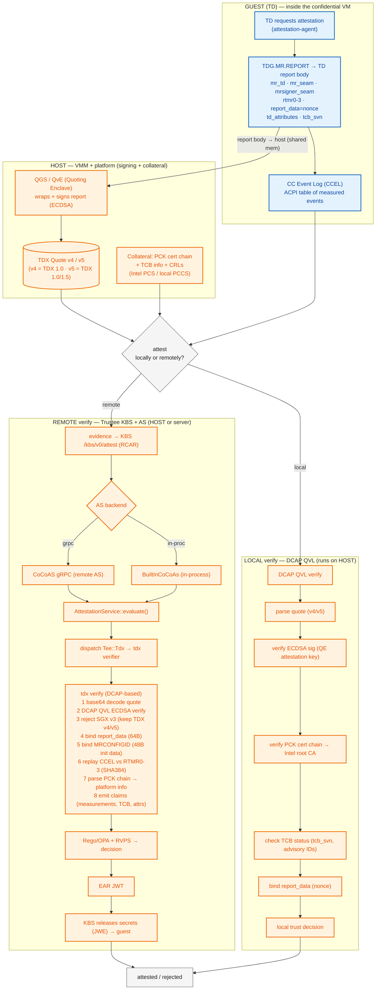
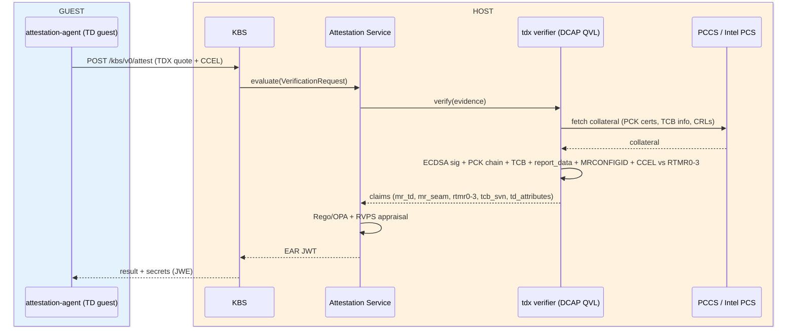

# Intel TDX Attestation Process — Graph

**Scope:** TDX core flow only (quote generation → local or remote verification → appraisal → key release).
**Basis:** SLES 16.1 source tree.
**Local vs remote:** *local* = DCAP QVL verifies the quote on the same host using locally-cached PCCS collateral (no Trustee). *remote* = quote sent to Trustee (KBS + Attestation Service).
**Guest vs host:** blue = runs **inside the TD (guest VM)**; orange = runs **on the host** (VMM / platform / verifier). The TD report body is generated in the guest, then handed to the host-side QGS to be signed into a quote.

---

## 1. Main flow — local vs remote (guest vs host)

---

## 2. Remote path — RCAR sequence (guest vs host)

Request-Challenge-Attestation-Response exchange. Blue box = guest, orange box = host.

---

## 3. Legend

### Placement (who runs where)

| Color | Runs in | Components |
| ------- | --------- | ----------- |
| 🔵 Blue | **Guest (TD)** | attestation-agent, `TDG.MR.REPORT` + TD report body, CC Event Log (CCEL), `report_data` nonce |
| 🟠 Orange | **Host (VMM / platform / verifier)** | QGS / QvE (quote signing), PCK chain + collateral (PCCS/PCS), DCAP QVL (local verify), Trustee KBS + AS (remote verify) |

> The **TD report body** is created in the guest, then crosses to the host where the QGS signs it into the **TDX Quote**. All verification (local or remote) runs outside the guest.

### Terms

| Term | Meaning |
| ------ | --------- |
| **TD** | Trust Domain — the confidential VM (TDX equivalent of an AMD SNP guest). |
| **QGS** | Quote Generation Service — host service that produces the signed TDX quote from a TD report. |
| **QvE** | Quote Verification Enclave — enclave-based alternative to the QVL for quote work. |
| **QVL** | Quote Verification Library — DCAP library that verifies TDX/SGX quotes. |
| **QE** | Quoting Enclave — signs the quote with its attestation key. |
| **PCK** | Provisioning Certification Key — per-platform key; the PCK cert binds it to the platform TCB level. |
| **PCS** | Provisioning Certification Service — Intel cloud service for collateral (PCK certs, TCB info, CRLs). |
| **PCCS** | Provisioning Certification Caching Service — local cache of PCS collateral (Node.js + SQLite); enables offline verification after an initial sync. |
| **RTMR0-3** | Four 48-byte extend-only runtime measurement registers. RTMR0 = SEAM module, RTMR1 = TDVF firmware, RTMR2 = guest bootloader/kernel, RTMR3 = guest OS. |
| **CCEL** | CC Event Log — ACPI table describing measured events; replayed against RTMR0-3 (SHA384) to prove the log is authentic. |
| **mr_td** | Measurement of the TD (guest image/config) — the TDX analogue of AMD's launch digest. |
| **mr_seam** | Measurement of the SEAM module (TDX firmware). |
| **mr_config_id** | Measurement of the TD's configuration (init data); checked against the expected init-data hash. |
| **report_data** | 64-byte field carrying the challenge nonce, binds the quote to this attestation session. |
| **tcb_svn** | TCB Sub-Version numbers — used for TCB status checks (security advisories). |
| **td_attributes** | TD attribute bits (e.g. debug enabled/disabled). |
| **EAR** | EAT Attestation Result — JWT (built on EAT, RFC 9711) the AS returns after appraisal. |
| **RCAR** | Request-Challenge-Attestation-Response — the KBS attestation protocol. |
| **RVPS** | Reference Value Provider Service — supplies expected measurements for appraisal. |
